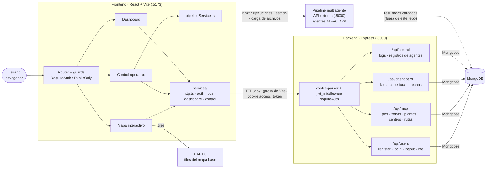

# Ferromap — Censo de ferreterías

> Cada ferretería de Colombia en un mismo mapa, lista para decidir a dónde ir primero.

## Por qué existe Ferromap

Imagina a una asesora comercial que empieza la semana con una libreta, una ruta en la cabeza y un barrio por recorrer. Entra a cada ferretería, anota el nombre, calcula el tamaño a ojo y pregunta qué marcas vende. Semanas después, esa libreta se suma a un Excel de otra región y a lo que un compañero contó en la reunión del lunes. Cuando por fin alguien intenta juntarlo todo, la información ya está desactualizada y no hay forma de compararla.

Así se conocen hoy las ferreterías en Colombia. Ferromap nace para atacar cuatro problemas concretos:

- **No hay una base centralizada.** Ningún directorio nacional de ferreterías tiene cobertura completa.
- **Los datos no hablan el mismo idioma.** Cuadernos, hojas de Excel y reportes verbales no se pueden consolidar.
- **Nada se actualiza solo.** Todo depende de que un asesor visite el punto de venta.
- **Sin estructura no hay análisis.** Sin datos ordenados no se puede segmentar el mercado ni estudiar a la competencia.

## Qué hace

Ferromap convierte esa información dispersa en una herramienta de inteligencia competitiva, mapeo logístico y priorización territorial. Su objetivo es que el equipo comercial de una empresa ferretera tome decisiones estratégicas con datos, no con intuiciones. La plataforma se apoya en un pipeline de datos de cinco capas que valida la calidad de la información antes de que llegue a los reportes, incluidos los de Power BI.

Todo eso se ve en tres vistas:

- **Mapa interactivo.** Muestra dónde se concentran las ferreterías y qué tan prioritaria es cada una. Filtra por tamaño, tipo, estado, fuente y zona, y superpone plantas de cemento, centros de distribución y rutas para ver las zonas de influencia operativa.
- **Dashboard.** Resume el mercado en KPIs, cobertura de puntos de venta, brechas competitivas y potencial de crecimiento por región.
- **Control operativo.** Lanza los agentes del pipeline, sigue cada ejecución, carga archivos de entrada y guarda el historial. Por ahora este módulo solo está implementado en el frontend.

El resultado: donde antes había semanas de visitas y libretas sueltas, hay un mapa que muestra dónde está la oportunidad.

## Stack

| Capa | Tecnologías |
|---|---|
| Frontend (`frontend/`) | React 19, TypeScript, Vite, React Router 7, Tailwind CSS v4, shadcn/ui (Radix + lucide), Leaflet / react-leaflet, Recharts, TanStack Table, React Hook Form + Zod |
| Backend (`backend/`) | Node.js, Express 5, MongoDB (Mongoose), JWT en cookie httpOnly, bcrypt, Zod |
| Servicios externos | Pipeline multiagente (API en `:5000`, fuera de este repositorio), tiles del mapa base de CARTO |

## Estructura del proyecto

```
ferromap-v1/
├── backend/                  API Express + MongoDB
│   ├── src/
│   │   ├── index.js          Punto de entrada (carga .env y arranca el servidor)
│   │   ├── app.js            App Express: middlewares y montaje de routers
│   │   ├── config/           Conexión a MongoDB y arranque del servidor
│   │   ├── routes/           Routers: users, map, dashboard, control
│   │   ├── controller/       Un controlador por modelo (getAllX)
│   │   ├── model/            Esquemas Mongoose
│   │   ├── middleware/       JWT, requireAuth, validación de entradas
│   │   ├── validations/      Esquemas Zod y errores
│   │   └── utils/
│   ├── json/, backups/       Datos de referencia en JSON
│   └── views/                Plantillas EJS
│
└── frontend/                 SPA React + Vite (paquete ferromap-ui)
    └── src/
        ├── main.tsx, App.tsx
        ├── routes/           Tabla de rutas y guards de autenticación
        ├── components/
        │   ├── Mapa_Interactivo/   Vista del mapa (Leaflet, clustering, capas)
        │   ├── ControlOperativo/   Agentes, ejecuciones, cargas e historial
        │   ├── Dashboard/          KPIs y gráficas
        │   ├── Login/, auth/       Inicio de sesión
        │   ├── layout/             Header + layout de la app
        │   ├── shared/             Componentes compartidos (modales)
        │   └── ui/                 Componentes shadcn/ui
        ├── services/         Acceso a datos: http.ts, auth, pos, dashboard,
        │                     control y pipelineService (API :5000)
        ├── lib/              Estado de filtros y selección del mapa, clustering
        ├── constants/        Paleta de colores y catálogos de estados
        ├── hooks/, utils/, data_ts/
        ├── App.css           Clases de estilo reutilizables (ui-*)
        └── index.css         Tokens de Tailwind
```

## Ejecución

Requisitos: Node.js (desarrollado con v24) y npm, acceso a una base de datos MongoDB y, para lanzar agentes desde Control operativo, el pipeline externo corriendo en `http://127.0.0.1:5000`.

### Backend

Crea `backend/.env` con estas variables:

```
PORT=3000
MONGODB_URI=<cadena de conexión de MongoDB>
SECRET_JWT_KEY=<clave para firmar los JWT>
```

Luego:

```bash
cd backend
npm install
npm run dev
```

`npm run dev` arranca con nodemon (recarga en caliente); `npm start` lo ejecuta con Node sin recarga. Cuando todo va bien, la consola muestra `MongoDB connected` y `Servidor escuchando en el puerto 3000`.

### Frontend

Copia `frontend/.env.example` a `frontend/.env` y define `VITE_CARTO_API_KEY` (necesaria para el mapa base). Las demás variables son opcionales.

```bash
cd frontend
npm install
npm run dev
```

Vite sirve la app (por defecto en `http://localhost:5173`) y redirige `/api/users`, `/api/map`, `/api/dashboard` y `/api/control` al backend en `localhost:3000`, así que el backend debe estar corriendo. Otros comandos:

```bash
npm run build
```

```bash
npm run lint
```

`npm run build` hace la verificación de tipos (`tsc -b`) y genera el bundle en `dist/`. No hay suite de tests en ninguno de los dos paquetes.

## Arquitectura



**Lectura del diagrama**

- **Lecturas.** Toda lectura de datos pasa por el backend Express. Cada vista pide sus datos una vez al montarse, a través de su servicio en `frontend/src/services/`. En desarrollo, Vite redirige esas llamadas a `:3000`.
- **Autenticación.** El login deja un JWT en la cookie httpOnly `access_token`. `jwt_middleware` la valida en cada petición y `requireAuth` responde 401 en los routers protegidos. En el frontend, cualquier 401 cierra la sesión.
- **Escrituras.** Lanzar agentes, consultar el estado de una ejecución o cargar archivos va directo al pipeline externo en `:5000`, sin pasar por Express.
- **Del pipeline a la base de datos.** Los datos que muestra la app vienen de la salida del pipeline, cargada en las colecciones de MongoDB que expone el backend. Esa carga no forma parte de este repositorio, por eso la flecha es punteada.
